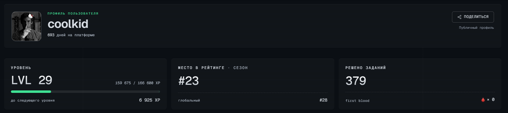
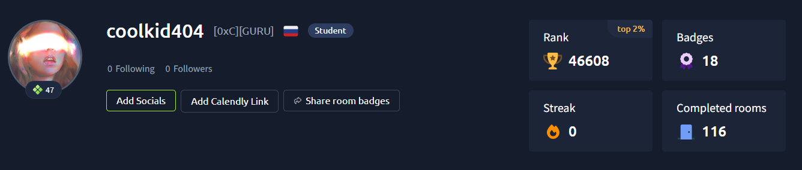

<!-- Заголовок с анимацией (опционально, требует подключения внешнего сервиса) -->
<h1 align="center">👋 Привет, я coolkid</h1>

<!-- Анимированная строка (можно заменить на статичный текст) -->

  

---

## 👨‍💻 Обо мне

🔹 C programmer — пишу на C, люблю низкоуровневую разработку
🔹 InfoSec researcher — исследую уязвимости и защиту
🔹 Pentest, Cryptography, Reverse Engineering, Steganography & Forensics
🔹 Web security — тоже в зоне моих интересов
🔹 🏴‍☠️ CTF enthusiast — постоянно решаю задачи

---

## 🛠️ Технологии и направления

| Область | Технологии / Инструменты |
|---------|--------------------------|
| **Языки** | `C`, `Python`, `Bash` |
| **Реверс-инжиниринг** | `Ghidra`, `IDA Pro`, `gdb` |
| **Криптография** | `OpenSSL`, `hashcat`, `cryptanalysis`, `John` |
| **Стеганография** | `steghide`, `binwalk` |
| **Форензика** | `Autopsy`, `Wireshark` |
| **Пентест** | `Burp Suite`, `Nmap`, `Metasploit`, `SQLmap` |
| **Веб-безопасность** | `XSS`, `SQLi`, `CSRF`, `JWT` |

---

## 🏆 CTF Достижения

### Мои профили на платформах

| Платформа | Скриншот |
|-----------|----------|
| [**HackerLab**](https://www.hackthebox.com/) |  |
| [**TryHackMe**](https://tryhackme.com/) |  |
